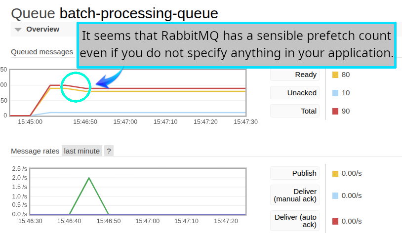

# Default `prefetch-count` of `@golevelup/nestjs-rabbitmq`

When I do not specify the prefetch count in my NestJS application, [golevelup will pick a sensible default value of **10** for it](https://github.com/golevelup/nestjs/blob/3cbf0b90773aba602fd485a2c3bf96dd0e69bace/packages/rabbitmq/src/amqp/connection.ts#L104).



As you can see in this screenshot you do not need to do declare it in your own app:

```ts
import { RabbitMQModule } from '@golevelup/nestjs-rabbitmq';

@Module({
  imports: [
    RabbitMQModule.forRoot({
      // ...
      prefetchCount: 10,
      // ...
    });
  ]
})
export class AppModule {}
```

## Getting Started

1. `pnpm i`.
2. `docker compose up --build -d`.
3. `python3 send_req.py`
